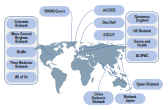

<div class="well">

The __Biobank Rare Variant Analysis__ (BRaVa) consortium, is a collaboration with the goal of bringing together analysts from global biobanks and cohorts to aggregate and analyse rare (coding) variant associations in __WES/WGS data__.

We will work to __harmonise calling, QC, and data handling__ to generate __robust associations__ for a set of __well curated phenotypes__ put forward by members of the consortium.

BRaVa will enhance the power of rare variant association testing, enable the __cross-validation__ of results, and facilitate the analysis of __understudied__ diseases/disorders and traits, particularly those too rare to study in an individual cohort.

BRaVa is __open and collaborative__. If you'd like to join us, ping us an e-mail at __[bravaconsortium@gmail.com](mailto:bravaconsortium@gmail.com)__.
</div>
<center>
```{r logo, echo=FALSE, out.width = '100%'}

```
</center>